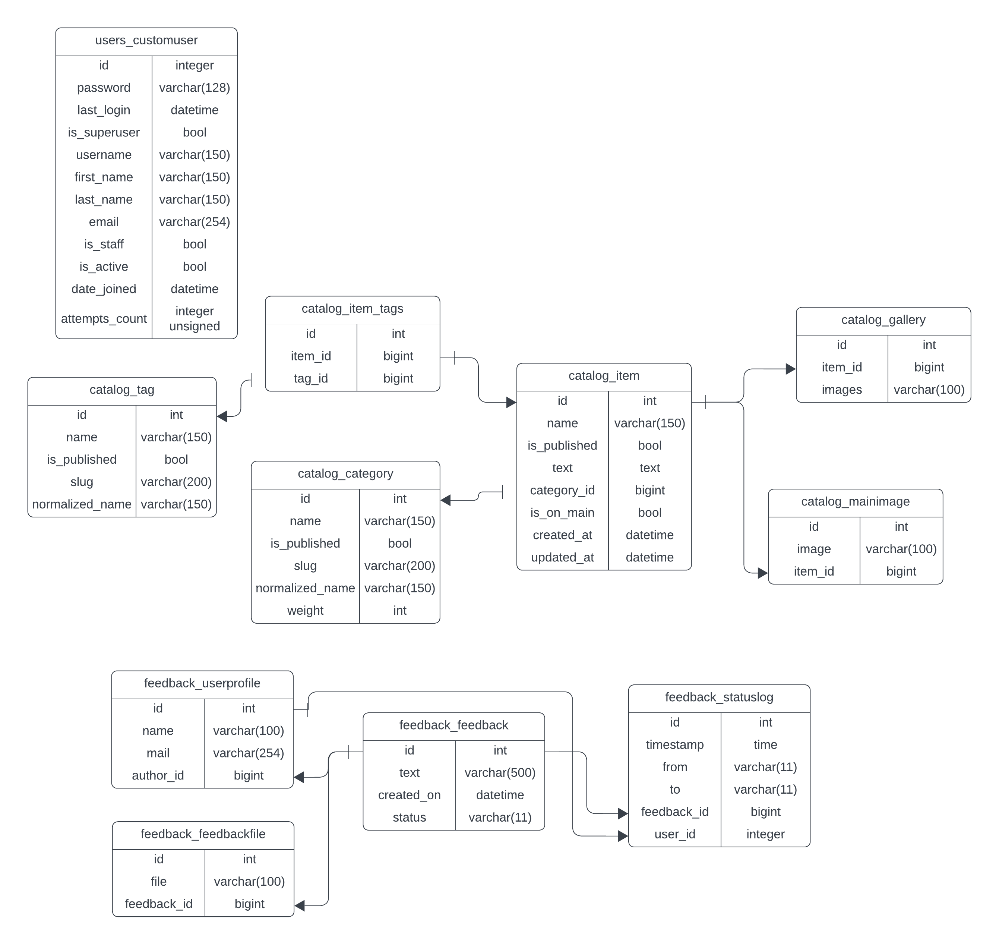

# Проект Lyceum

[](https://gitlab.crja72.ru/django/2024/autumn/course/students/172792-mario12526-course-1187/-/commits/main)

## Запуск проекта в режиме разработки

### Шаг 1: Установка и активация виртуального окружения

Устанавливаем виртуальное окружение:
```commandline
python -m venv venv
```

Активируем его:
- Для Linux/macOS:
    ```
    source venv/bin/activate
    ```
- Для Windows:
    ```
    venv\Scripts\activate
    ```

### Шаг 2: Установка зависимостей

Создаем файл `requirements.txt` и устанавливаем зависимости:
```commandline
pip install -r requirements.txt
```

### Шаг 3: Настройка переменных окружения

Создайте файл `.env.template` с содержимым:
```
SECRET_KEY='your-secret-key' 
DEBUG=True
DJANGO_ALLOWED_HOSTS='127.0.0.1,localhost'
DJANGO_ALLOW_REVERSE=False
```

После этого создайте файл `.env` на основе шаблона:
```
cp .env.template .env
```

Настройте в файле `.env` секретный ключ и другие переменные.

### Шаг 4: Запуск проекта

Перейдите в папку с файлом `manage.py`:
```
cd <название_проекта>
```

Запускаем сервер разработки:
```commandline
python manage.py runserver
```

### Шаг 5: Открытие проекта

Откройте проект в браузере по адресу:
```
http://127.0.0.1:8000/
```

### ER Диаграмма


